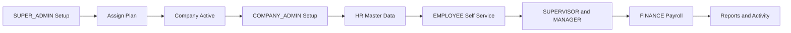
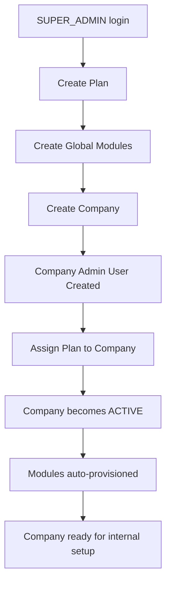
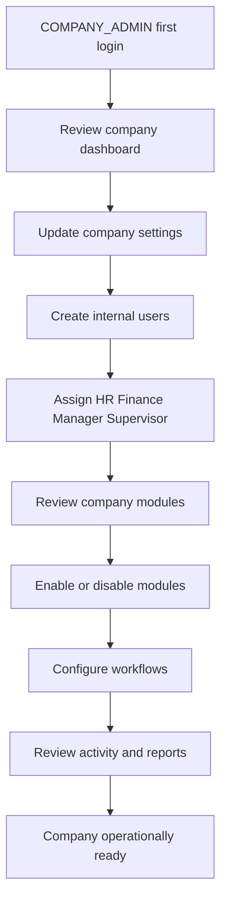
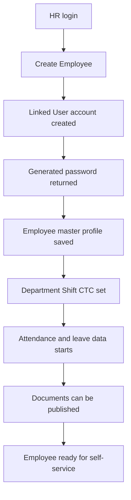
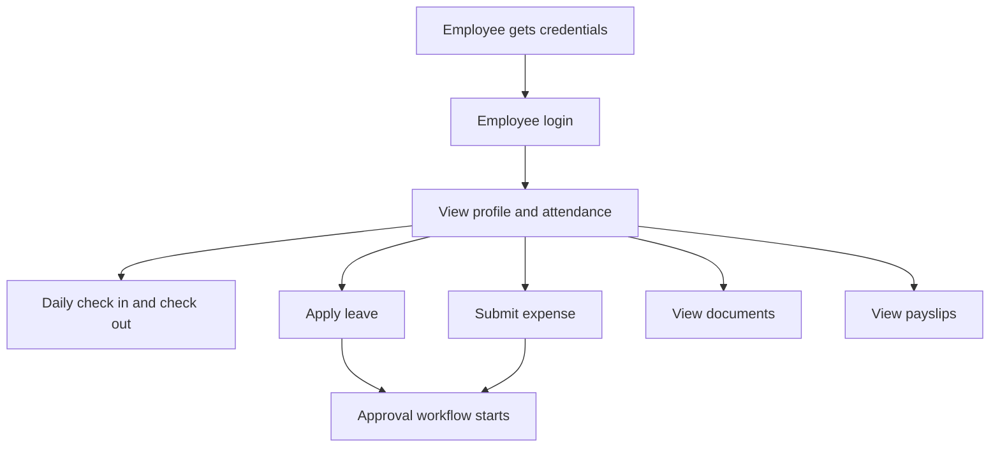
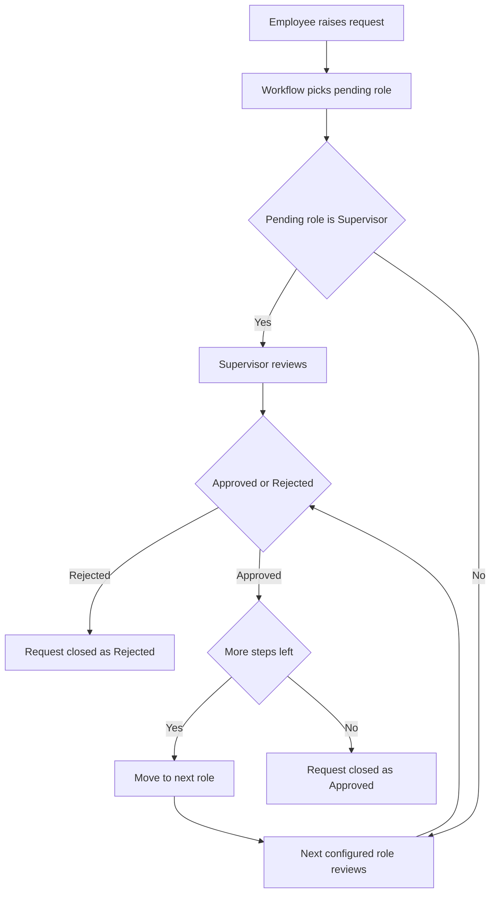
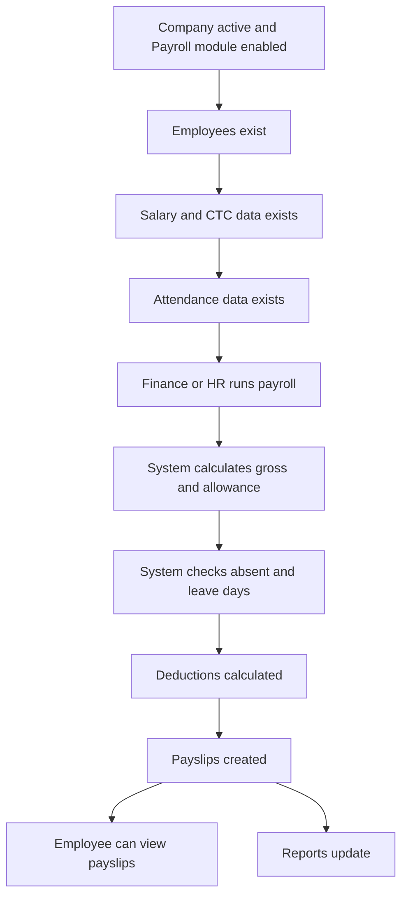
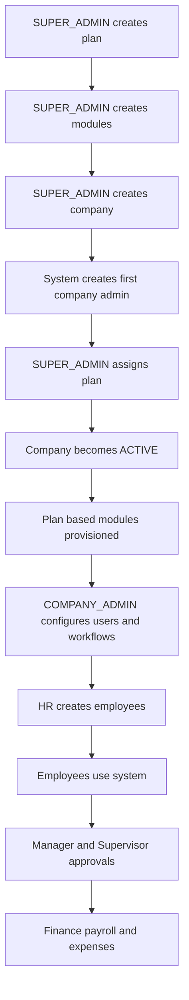
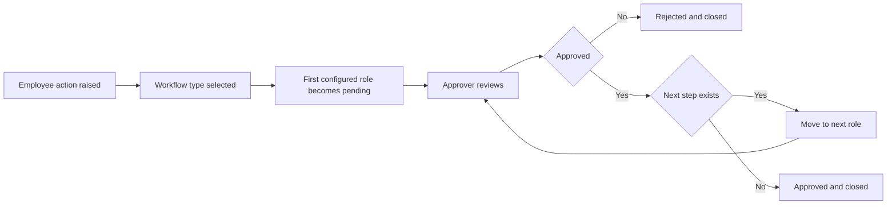
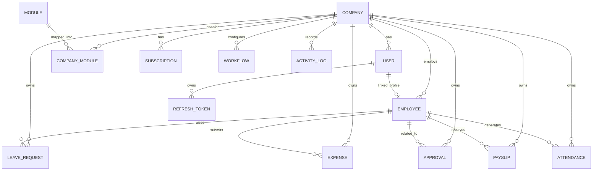

# Vook Business Flow

Ye document business flow samjhane ke liye hai.  
Main focus ye hai: system ko real life me kaun pehle use karta hai, phir next role kya karta hai, aur poora setup employee aur payroll tak kaise pahunchta hai.

## 1. High-Level Samajh Lo

Ideal business order:

1. `SUPER_ADMIN` SaaS setup karta hai
2. `SUPER_ADMIN` company banata hai aur plan assign karta hai
3. `COMPANY_ADMIN` company ka internal setup karta hai
4. `HR` employees aur workforce data banata hai
5. `EMPLOYEE` self-service use karta hai
6. `SUPERVISOR` aur `MANAGER` approvals aur operations handle karte hain
7. `FINANCE` payroll aur expenses process karta hai
8. Reports aur activity business visibility dete hain

Important:
- Kuch screens pehle se visible ho sakti hain
- But sahi business usage order upar wala hi hai
- Agar setup order follow nahi hua, to later screens me empty data, blocked feature, ya confusion mil sakta hai

## 2. Overall Lifecycle Diagram



ASCII fallback:
```text
SUPER_ADMIN Setup
-> Assign Plan
-> Company Active
-> COMPANY_ADMIN Setup
-> HR Master Data
-> EMPLOYEE Self Service
-> SUPERVISOR and MANAGER
-> FINANCE Payroll
-> Reports and Activity
```

## 3. Role-by-Role Full Flow

## 3.1 `SUPER_ADMIN` Flow

Ye role system ka starting point hai. Iske bina company usable state me nahi aati.

### `SUPER_ADMIN` kya karta hai

1. SaaS plans create karta hai
2. Global modules create karta hai
3. Company create karta hai
4. Company ke liye first `COMPANY_ADMIN` account create hota hai
5. Company ko plan assign karta hai
6. Assigned plan ke basis par modules auto-provision hote hain
7. Company `ACTIVE` ho jati hai
8. Future me plan update ya deactivate bhi yehi karta hai

### Business meaning

- Plan define karta hai business package
- Module define karta hai feature catalog
- Company define karti hai tenant
- Plan assignment company ke usable features unlock karta hai

### `SUPER_ADMIN` setup flow diagram



ASCII fallback:
```text
SUPER_ADMIN login
-> Create Plan
-> Create Global Modules
-> Create Company
-> Company Admin User Created
-> Assign Plan to Company
-> Company becomes ACTIVE
-> Modules auto-provisioned
-> Company ready for internal setup
```

### Real system behavior

- Plan `Subscriptions` area me banta hai
- Module `Modules` area me banta hai
- Company `Companies` area me banti hai
- Plan assign hote hi subscription record update hota hai
- Company plan, expiry, max users update hote hain
- Available modules `CompanyModule` me insert ho jate hain

## 3.2 `COMPANY_ADMIN` Flow

Ye role company ka internal owner hai. `SUPER_ADMIN` company bana ke deta hai, phir actual internal setup `COMPANY_ADMIN` karta hai.

### `COMPANY_ADMIN` kya karta hai

1. Dashboard dekh kar company status samajhta hai
2. Company settings update karta hai
3. Users create karta hai
4. HR / Finance / Manager / Supervisor users banata hai
5. Company modules review karta hai
6. Kuch modules enable ya disable karta hai
7. Workflows configure karta hai
8. Role permissions review karta hai
9. Activity logs aur reports dekhta hai

### Business meaning

Yaha se company "tenant exists" se "tenant operationally ready" state me jati hai.

### `COMPANY_ADMIN` setup flow diagram



ASCII fallback:
```text
COMPANY_ADMIN first login
-> Review company dashboard
-> Update company settings
-> Create internal users
-> Assign HR Finance Manager Supervisor
-> Review company modules
-> Enable or disable modules
-> Configure workflows
-> Review activity and reports
-> Company operationally ready
```

### Dhyan dene wali baatein

- Agar `HR` user nahi banaya, to employee master data build nahi hoga
- Agar workflow configure nahi kiya, to default approval workflow chalega
- Agar module off hai, to related backend endpoints block ho sakte hain
- Agar Finance user bana diya but payroll data nahi banaya, to finance screens useful nahi hongi

## 3.3 `HR` Flow

`HR` role core data creator hai. Real business me sab operational modules isi role ke baad meaningful bante hain.

### `HR` kya karta hai

1. Employee create karta hai
2. Employee ke saath linked login user automatically create hota hai
3. Employee ko generated password milta hai
4. Department, designation, joining date, bank details, CTC, shift info set karta hai
5. Attendance records manage karta hai
6. Leave requests monitor karta hai
7. Approvals dekh sakta hai
8. Payroll base data ready karta hai
9. Documents upload karta hai jo employees dekh sakte hain

### Business meaning

`HR` ke bina:
- Employee login ka business value low hai
- Payroll run nahi hoga
- Attendance meaningful nahi hoga
- Approval chain ka base data weak rahega

### `HR` to employee onboarding flow diagram



ASCII fallback:
```text
HR login
-> Create Employee
-> Linked User account created
-> Generated password returned
-> Employee master profile saved
-> Department Shift CTC set
-> Attendance and leave data starts
-> Documents can be published
-> Employee ready for self-service
```

## 3.4 `EMPLOYEE` Flow

Ye self-service role hai. Iska kaam mostly apna data dekhna aur requests raise karna hai.

### `EMPLOYEE` kya karta hai

1. Login karta hai
2. Apna profile dekhta hai
3. Attendance dekhta hai
4. Check-in aur check-out karta hai
5. Leave apply karta hai
6. Expense submit karta hai
7. Payslips dekhta hai
8. Company documents dekhta hai
9. Profile update kar sakta hai

### Business meaning

Employee khud bhi operational data generate karta hai:
- Leave request
- Expense request
- Attendance actions

Ye sab baad me approval, reporting aur payroll ko affect karte hain.

### `EMPLOYEE` usage flow diagram



ASCII fallback:
```text
Employee gets credentials
-> Employee login
-> View profile and attendance
-> Daily check in and check out
-> Apply leave
-> Submit expense
-> View documents
-> View payslips
-> Approval workflow starts
```

## 3.5 `SUPERVISOR` and `MANAGER` Flow

Ye dono roles operational control aur approval chain me kaam karte hain.

### In roles ka kaam

1. Team workforce view dekhna
2. Attendance aur shift operations dekhna
3. Pending approvals act karna
4. Workflow step ke hisaab se leave, correction, ya expense approve ya reject karna
5. Team reports dekhna

### Actual workflow dependency

Default flow generally:
- Leave flow: `SUPERVISOR -> MANAGER -> HR`
- Expense flow: `MANAGER -> COMPANY_ADMIN`
- Correction flow: `SUPERVISOR -> HR`

Iska matlab:
- Manager ya Supervisor independent system nahi chalate
- Unka kaam employee-raised requests aur HR-created structure par depend karta hai

### Approval flow diagram



ASCII fallback:
```text
Employee raises request
-> Workflow picks pending role
-> If pending role is Supervisor, Supervisor reviews
-> Else next configured role reviews
-> If Rejected, request closed as Rejected
-> If Approved and more steps left, move to next role
-> If Approved and no steps left, request closed as Approved
```

## 3.6 `FINANCE` Flow

Finance role ka real value tab start hota hai jab HR ne employee, CTC, attendance aur payroll base setup kar diya ho.

### `FINANCE` kya karta hai

1. Salary structures review karta hai
2. Payslips review karta hai
3. Payroll run karta hai
4. Expenses review karta hai
5. Expense approve ya reject karta hai
6. Payroll reports aur attendance reports dekhta hai

### Business meaning

Finance independent starting role nahi hai. Ye downstream role hai.

Pehle ye data hona chahiye:
- Company active ho
- Payroll module enabled ho
- Employees created ho
- Annual CTC ya salary structure available ho
- Attendance records available ho

### Payroll flow diagram



ASCII fallback:
```text
Company active and Payroll module enabled
-> Employees exist
-> Salary and CTC data exists
-> Attendance data exists
-> Finance or HR runs payroll
-> System calculates gross and allowance
-> System checks absent and leave days
-> Deductions calculated
-> Payslips created
-> Employee can view payslips
-> Reports update
```

## 4. Full Recommended Improved Flow

Ye section "app ko kaise samajhna aur use karna chahiye" batata hai.

### Recommended business order

1. Global SaaS setup
   `SUPER_ADMIN` plan, modules aur companies define kare
2. Tenant activation
   Company ko plan assign ho, company active ho, base modules provision ho
3. Tenant internal setup
   `COMPANY_ADMIN` users, workflows, settings aur modules align kare
4. Workforce creation
   `HR` employees, department data, attendance base aur documents setup kare
5. Employee operations
   `EMPLOYEE` leave, expense, attendance use kare
6. Approval operations
   `SUPERVISOR`, `MANAGER`, `HR`, `COMPANY_ADMIN` configured workflow ke hisaab se act karein
7. Financial operations
   `FINANCE` payroll aur expenses process kare
8. Business visibility
   Reports, activity aur dashboards monitoring karein

### Why this is better

Is sequence me:
- Prerequisite data pehle banta hai
- Later screens empty ya misleading nahi lagte
- Company module confusion kam hota hai
- Payroll aur approvals real data par chalte hain

## 5. Current Mismatch and Confusion Areas

### 1. Screens pehle dikh jati hain, business setup baad me hota hai

Problem:
- User route open kar leta hai
- But us feature ke liye data ya setup abhi hua hi nahi hota

Example:
- Payroll page open ho sakta hai
- But salary, attendance, aur employee data missing ho to page business-wise ready nahi hota

### 2. Frontend visibility aur backend module enablement alag cheez hai

Problem:
- Frontend route role ke basis par visible ho sakta hai
- Backend `requireModule()` usko phir bhi block kar sakta hai

Isliye:
- "screen available" aur "feature truly active" same cheez nahi hain

### 3. `companyId` handling mixed hai

Problem:
- Kuch flows token-based company context lete hain
- Kuch flows query param se company context lete hain

Risk:
- Audit, debugging, aur documentation me confusion hota hai

### 4. Reports aur payroll downstream dependency wale modules hain

Problem:
- Reports aur payroll ko early screens ki tarah present kiya ja sakta hai
- But unke liye upstream setup already complete hona chahiye

### 5. Role boundaries pure isolated nahi hain

Actual reality:
- `MANAGER`, `SUPERVISOR`, `FINANCE` sab HR-created data model use karte hain
- Isliye business boundaries overlap karti hain

Ye wrong nahi hai, but doc me clearly bolna chahiye.

## 6. Onboarding and Setup Master Diagram



ASCII fallback:
```text
SUPER_ADMIN creates plan
-> SUPER_ADMIN creates modules
-> SUPER_ADMIN creates company
-> System creates first company admin
-> SUPER_ADMIN assigns plan
-> Company becomes ACTIVE
-> Plan based modules provisioned
-> COMPANY_ADMIN configures users and workflows
-> HR creates employees
-> Employees use system
-> Manager and Supervisor approvals
-> Finance payroll and expenses
```

## 7. Approval Workflow Master Diagram



ASCII fallback:
```text
Employee action raised
-> Workflow type selected
-> First configured role becomes pending
-> Approver reviews
-> If not approved, Rejected and closed
-> If approved and next step exists, move to next role
-> If approved and no next step exists, Approved and closed
```

## 8. Core ER and Data Relation Diagram



ASCII fallback:
```text
COMPANY
-> USER
-> EMPLOYEE
-> COMPANY_MODULE
-> SUBSCRIPTION
-> LEAVE_REQUEST
-> EXPENSE
-> APPROVAL
-> PAYSLIP
-> ATTENDANCE
-> WORKFLOW
-> ACTIVITY_LOG

MODULE -> COMPANY_MODULE
USER -> EMPLOYEE
USER -> REFRESH_TOKEN
EMPLOYEE -> LEAVE_REQUEST
EMPLOYEE -> EXPENSE
EMPLOYEE -> APPROVAL
EMPLOYEE -> ATTENDANCE
EMPLOYEE -> PAYSLIP
```

## 9. Technical Appendix

### Frontend role areas to backend route groups

| Role or Area | Frontend | Backend |
|---|---|---|
| Super Admin | `/`, `/dashboard`, companies, subscriptions, modules, support | `/api/companies`, `/api/subscriptions`, `/api/modules`, `/api/support`, `/api/activity` |
| Company Admin | `/company-admin/*` | `/api/company-admin/*` |
| HR | `/hr/*` | `/api/hr/*` |
| Finance | `/finance/*` | `/api/finance/*` |
| Employee | `/employee/*` | `/api/employee/*` |
| Manager | `/manager/*` | mostly `/api/hr/*` read, approval, report usage |
| Supervisor | `/supervisor/*` | mostly `/api/hr/*` and workflow driven actions |

### Auth, role, aur module guard ka short meaning

- `authenticate`
  user valid token ke saath aaya ya nahi
- `requireRole`
  kya ye role is endpoint ko use kar sakta hai
- `requireModule`
  kya company ke paas ye feature enabled hai

### Token and hydrate summary

1. Login par token milta hai
2. Token frontend store me save hota hai
3. App reload par `hydrate()` user verify karta hai
4. Role ke hisaab se correct dashboard open hota hai
5. Har API request me token jata hai

## 10. Final One-Line Mental Model

```text
Super Admin business package banata hai
-> Company Admin company ko operational banata hai
-> HR workforce data banata hai
-> Employee requests raise karta hai
-> Supervisor and Manager workflow chalate hain
-> Finance payroll close karta hai
-> Reports business picture dikhate hain
```

